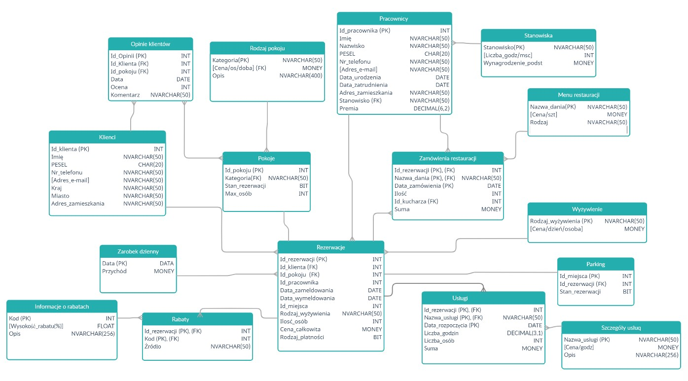

# 🏨 Hotel Database Project

### Welcome to the Hotel Database Project!🛎️

This database project was executed as part of the Database Systems course at Jagiellonian University. 

The project was done collaboratively with <a href="https://github.com/Karol0801">Karol0801</a>.

## Contents of the Database Description 📋

⮚ Basic assumptions and capabilities

⮚ Description of created views and functions

⮚ Description of created stored procedures

⮚ Description of created triggers

## Visual Representation

Below is a visual representation of the database schema:

